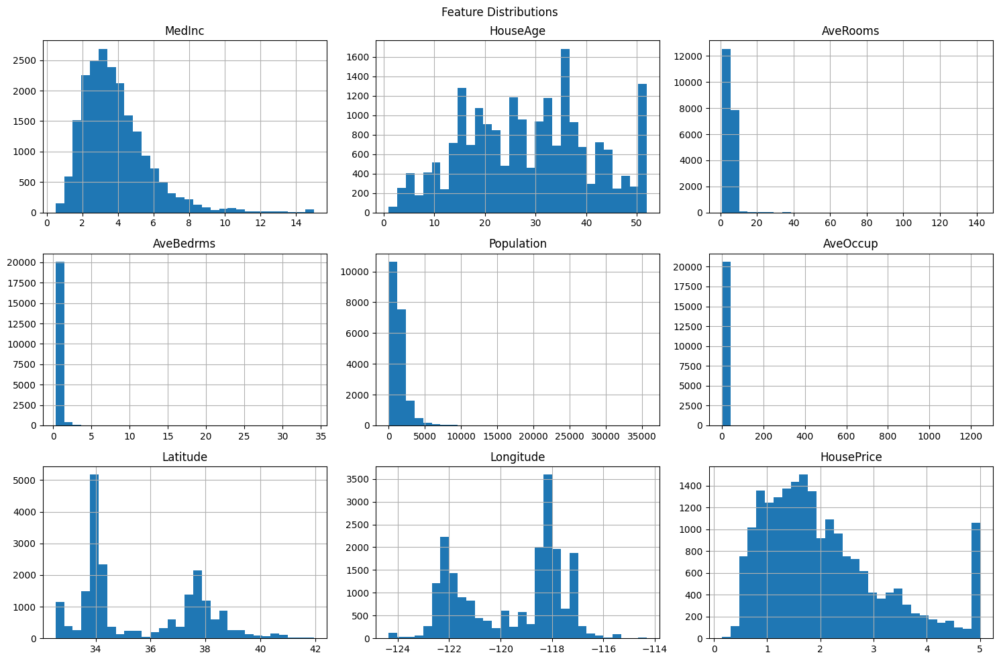
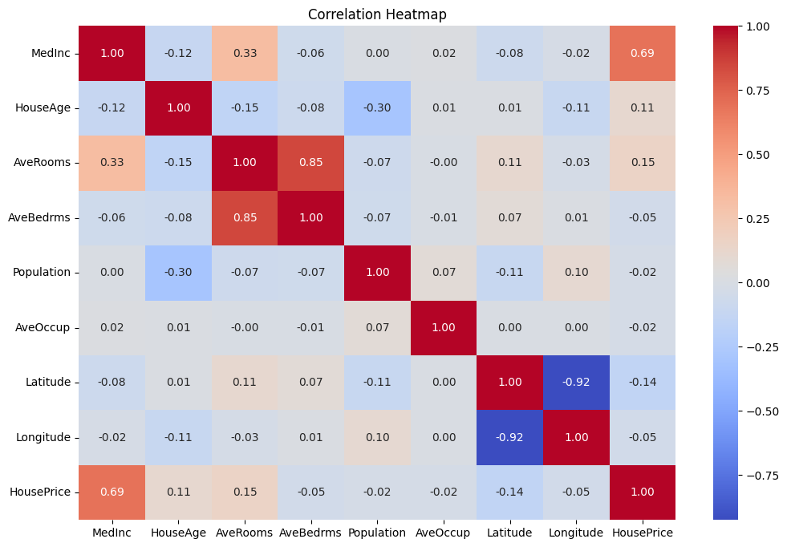
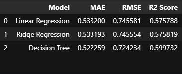
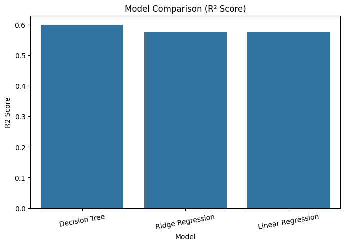
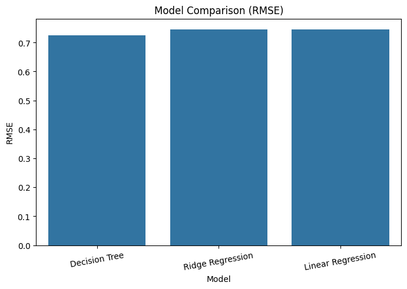
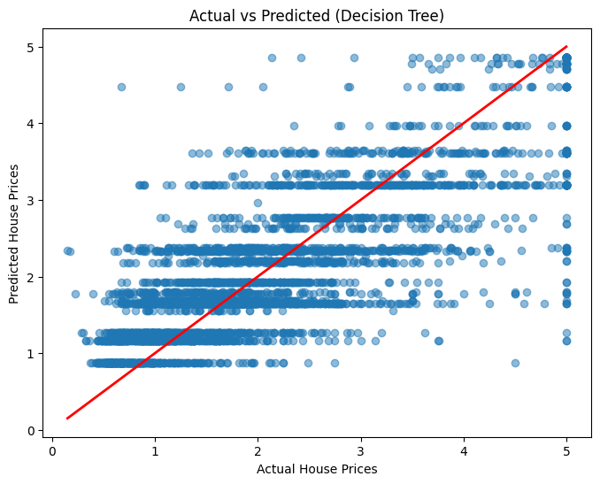
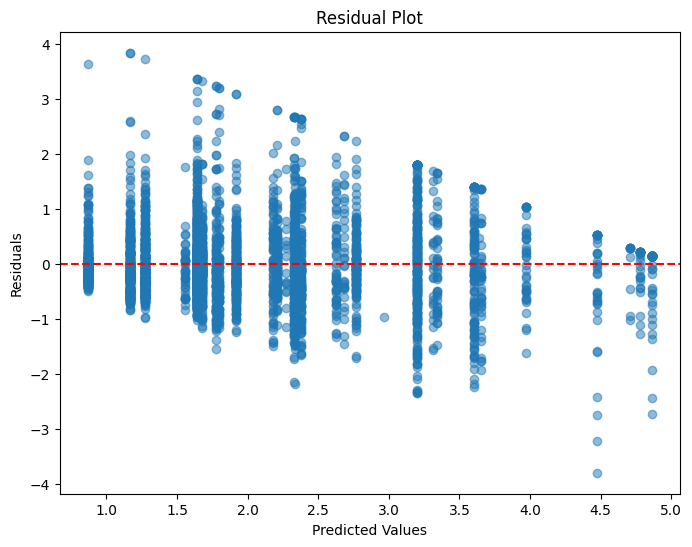
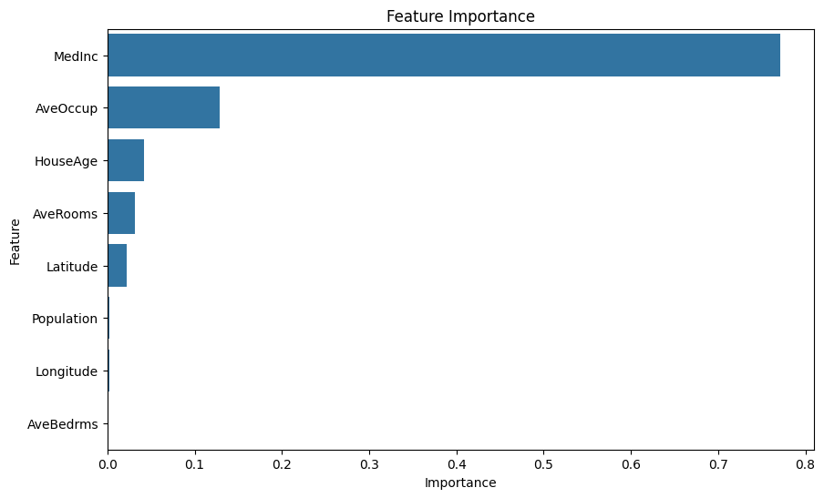

# 🏠 House Price Prediction using Feature Engineering & Model Comparison

## 📌 Overview

This project was completed as **Task 2** of the **Artificial Intelligence & Machine Learning Internship**.

The objective was to improve a basic House Price Prediction model by applying **Feature Engineering**, **Feature Scaling**, training multiple regression models, and comparing their performance.

---

## 🎯 Objectives

- Load and explore the California Housing Dataset
- Perform Exploratory Data Analysis (EDA)
- Apply Feature Scaling using StandardScaler
- Train multiple regression models
- Compare model performance
- Select the best-performing model
- Save the trained model

---

## 🛠 Technologies Used

- Python
- Pandas
- NumPy
- Matplotlib
- Seaborn
- Scikit-Learn
- Joblib
- Jupyter Notebook

---

## 📂 Dataset

**California Housing Dataset**

- Records: **20,640**
- Features: **8**
- Target Variable: **Median House Value**

---

# 📊 Exploratory Data Analysis

## Feature Distributions



---

## Correlation Heatmap



---

# 🤖 Models Used

- Linear Regression
- Ridge Regression
- Decision Tree Regressor

---

# 📈 Model Performance Comparison

## Comparison Table



---

## R² Score Comparison



---

## RMSE Comparison



---

# 📉 Model Evaluation

## Actual vs Predicted



---

## Residual Plot



---

# 🌳 Feature Importance



*(Displayed if Decision Tree is selected as the best-performing model.)*

---

# 📁 Project Structure

```
House-Price-Prediction-Model-Comparison/

│── AI_ML_Task2_Model_Comparison.ipynb

│── task2_model_comparison.py

│── report.pdf

│── requirements.txt

│── README.md

│── best_house_price_model.pkl

└── screenshots/

    ├── histograms.png

    ├── heatmap.png

    ├── model_comparison_table.png

    ├── r2_comparison.png

    ├── rmse_comparison.png

    ├── actual_vs_predicted.png

    ├── residual_plot.png

    └── feature_importance.png
```

---

# 🚀 Results

The models were evaluated using:

- Mean Absolute Error (MAE)
- Root Mean Squared Error (RMSE)
- R² Score

The best-performing model was selected based on these evaluation metrics.

---

# 🔮 Future Improvements

- Hyperparameter Tuning (GridSearchCV)
- Cross Validation
- Random Forest Regression
- XGBoost Regression
- Streamlit Deployment
- Feature Engineering

---

# 👨‍💻 Author

**Aman Raj**

MIT Art, Design and Technology University

Artificial Intelligence & Machine Learning Intern
